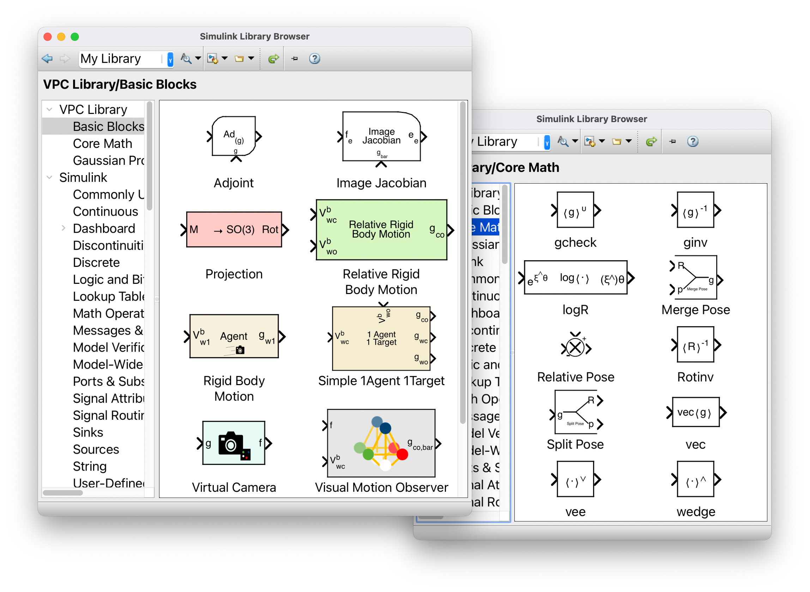
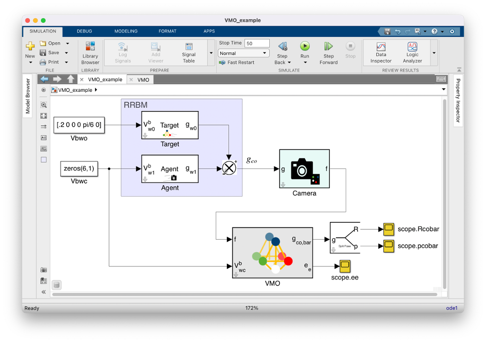
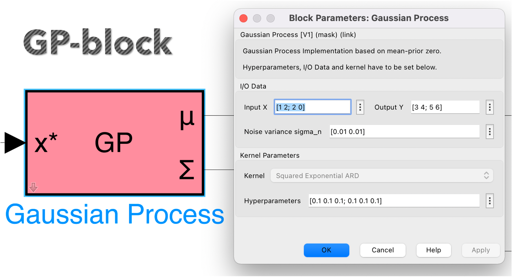

# Visual Pursuit Control Library

A MATLAB library for core VPC simulations and experiments.



It includes the essential code files for Visual Pursuit Control scenarios and a Simulink block library including:

- a Gaussian Process block
- a Visual Motion Observer block
- a virtual camera block
- core VPC and rigid body motion blocks

Template Simulink files for a quick start are given as well.




| Key | Notes |
| --- | --- |
| [](https://www.scl.ipc.i.u-tokyo.ac.jp) | [Fujita Laboratory, The University of Tokyo](https://www.scl.ipc.i.u-tokyo.ac.jp) |

## Getting started

Clone this repository with all its subdependencies to your local machine:

```bash
git clone --recurse-submodules https://github.com/macoska/visual-pursuit-control.git
```

Check the brief [starter guide](QUICK_START.md) for how to use this library.

## Citation

In case this repository has helped your work/research, please cite the following paper:

```css
@article{JCMSI21VPCGP,
    author  = {Marco Omainska and
               Junya Yamauchi and
               Thomas Beckers and
               Takeshi Hatanaka and
               Sandra Hirche and
               Masayuki Fujita},
    title   = {Gaussian process-based visual pursuit control with unknown target motion learning in three dimensions},
    journal = {SICE Journal of Control, Measurement, and System Integration},
    volume = {14},
    number = {1},
    pages = {116-127},
    year  = {2021},
    publisher = {Taylor & Francis},
    doi = {10.1080/18824889.2021.1936855},
    URL = {https://doi.org/10.1080/18824889.2021.1936855},
    eprint = {https://doi.org/10.1080/18824889.2021.1936855}
}
```

## Contact

In case of questions or possible collaborations, please visit our homepage:

[https://www.scl.ipc.i.u-tokyo.ac.jp](https://www.scl.ipc.i.u-tokyo.ac.jp)

Alternatively, you can contact us via e-mail:

```http
Marco Omainska: marcoomainska _at_ g.ecc.u-tokyo.ac.jp
```
